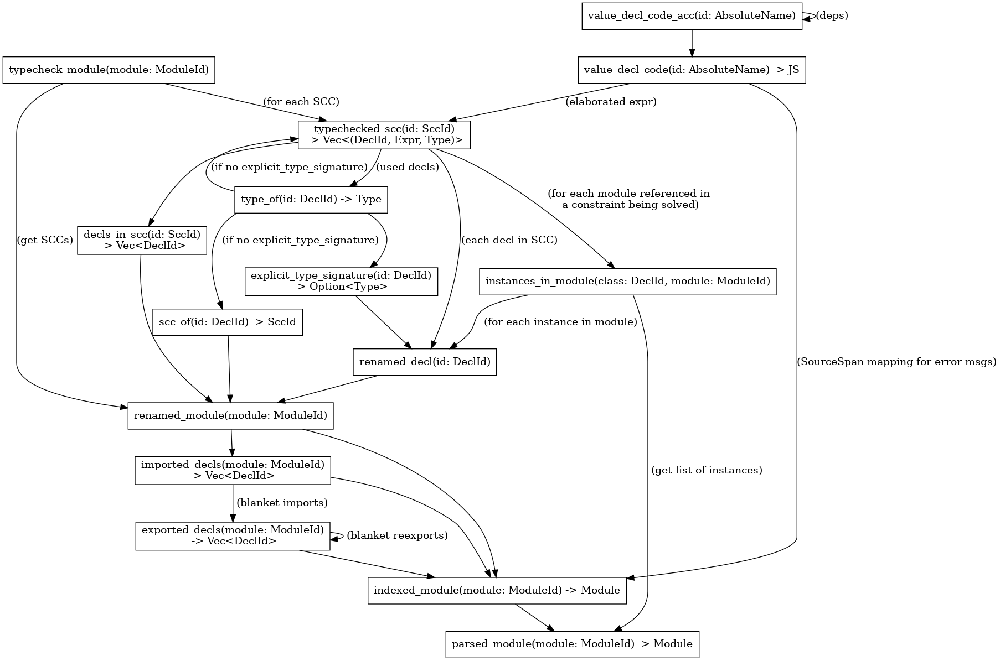

# Architecture

**NOTE**: This is a proposed architecture, not implemented yet.

This is an incremental compiler, so it doesn't have a traditional "pipeline".
It is structured as a graph of Salsa queries, which look like this:



## Vocabulary

### `DeclId`

A reference to a declaration, which may be any named thing in a module.

```rust
struct DeclId {
    namespace: Namespace,
    module: ModuleId,
    name: Symbol,
}

enum Namespace {
    Class,
    Type,
    Value
}
```

### SCC

A mutually recursive declaration group (strongly connected component in the graph of declarations in a module). Contains one or more declarations from a module.

This is the unit of type checking, since if we need to infer type signatures, we need to consider the whole group at once.

SCCs have assigned identifiers, so that we can refer to them in queries. They need to be stable to have good incrementality. For this reason, the identifier of a SCC is the lexicographically smallest DeclId in it.

## Description of the queries

### `parsed_module(module: ModuleId) -> Module`

Computes a parsed AST of the given module.

Source files are keyed by module ID, not filename - this mapping is done outside the incremental system.

The parsed representation contains spans relative to the start of the declaration, so that changing a declaration at the beginning of the file doesn't change the AST for subsequent ones. The spans are resolved when needed e.g. for error reporting.

### `renamed_module(id: DeclId) -> RenamedModule`

This does a bunch od passes:

1. Desugaring - lowering complicated language constructs (e.g. pattern guards) to simpler ones

2. Renaming - resolving references by name, taking imports and scoping into account

3. Computing strongly connected components of the declarations, and `DeclId`<->`SccId` mapping

This is done in one query, because SCC computation has to be done on whole module at once, so we might as well do the previous steps here.

Renaming uses some auxilliary queries:

#### `imported_decls(module: ModuleId) -> Vec<(Option<Symbol>, DeclId)>`

Imported names in scope in a given module, with module aliases if imported qualified.

#### `exported_decls(module: ModuleId) -> Vec<DeclId>`

Names exported from a given module.

Note: this can be recursive in case of blanket reexports.

### `renamed_decl(id: DeclId) -> Decl`

Extracts a declaration from a renamed module.

### `typecheck_scc(id: SccId) -> Vec<(DeclId, Expr, Type)>`

Typechecks a mutually recursive group of declarations (a SCC).

This uses some auxilliary queries:

#### `type_of(id: DeclId) -> Type`

Returns the type of a declaraton for the purposes of using it in a typechecked declaration.

Note that there's no guarantee that the type is correct - in most cases this just returns the explicit type signature.
Checking if it's correct is done separately.

This, however, gives us a nice dependency structure - declarations referring to a value don't depend on its contents, only type signature.

This is essentially:

```
if let Some(ty) = explicit_type_signature(id) {
    ty
} else {
    typechecked_scc(scc_of(id)).iter().find(|(id_, _, _)| id_ == id).3
}
```

#### `explicit_type_signature(id: DeclId) -> Option<Type>`

If a type signature is given, in the source, returns it.

### `scc_of(id: DeclId) -> SccId`

Maps a declaration ID to SCC ID. This is needed if you want to typecheck a specific `DeclId` - you can do it using `typechecked_scc(scc_of(id))`.

### `decls_in_scc(id: SccId) -> Vec<DeclId>`

Lists declarations in a SCC.

### `instances_in_module(class: DeclId, module: ModuleId) -> Vec<InstanceHead>`

Lists instances of the specified class defined in a given module.

This is sufficient to implement instance resolution in `typechecked_scc`, because for any given constraint, there is a small set of modules where the respective instance might be defined.
