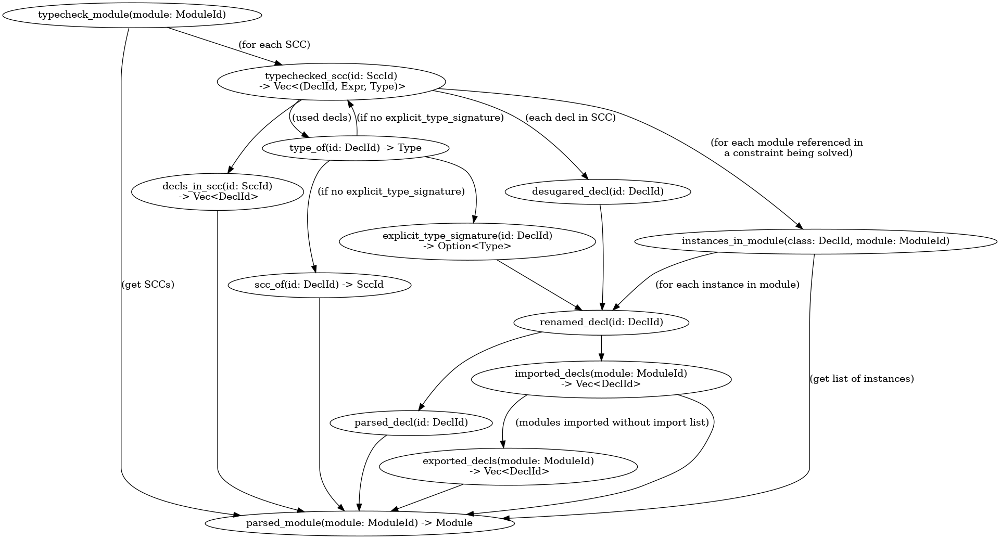

# Architecture

This is an incremental compiler, so it doesn't have a traditional "pipeline".
It is structured as a graph of Salsa queries, which look like this:



## Vocabulary

### `DeclId`

A reference to a declaration, which may be any named thing in a module.

```rust
struct DeclId {
    namespace: Namespace,
    module: ModuleId,
    name: Symbol,
}

enum Namespace {
    Class,
    Type,
    Value
}
```

### SCC

A mutually recursive declaration group (strongly connected component in the graph of declarations in a module). Contains one or more declarations from a module.

This is the unit of type checking, since if we need to infer type signatures, we need to consider the whole group at once.

SCCs have assigned identifiers, so that we can refer to them in queries. They need to be stable to have good incrementality. For this reason, the identifier of a SCC is the lexicographically smallest DeclId in it.

### `SourceDecl`

Source language AST.

### `CoreDecl`

A simplified intermediate language, should be similar to CoreFn from original compiler

## Description of the queries

### `parsed_module(module: ModuleId) -> Module`

Computes a parsed AST of the given module.

Source files are keyed by module ID, not filename - this mapping is done outside the incremental system.

The parsed representation contains _decl-relative spans_.

### `parsed_decl(id: DeclId) -> SourceDecl`

Extracts a declaration from a parsed module. It's a separate query so that invalidations can stop here if a decl doesn't change.

### `renamed_decl(id: DeclId) -> SourceDecl`


